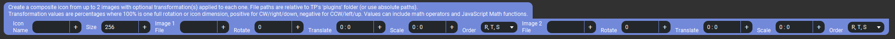

# TouchPortal-Dynamic-Icons
Generate Dynamic Icons for Touch Portal based on Actions and 0-100% values.

- [TouchPortal-Dynamic-Icons](#touchportal-dynamic-icons)
- [Change Log](#change-log)
- [What Is This?](#what-is-this)
- [Actions](#actions)
  - [Simple Round Gauge](#simple-round-gauge)
    - [Properties](#properties)
  - [Simple Bar Graph](#simple-bar-graph)
    - [Properties](#properties-1)
  - [Image Stack Icons](#image-stack-icons)
    - [Properties](#properties-2)
    - [Notes](#notes)
- [Sample Generator Uses](#sample-generator-uses)
  - [Simple Round Gauge - Usage from Events tab](#simple-round-gauge---usage-from-events-tab)
  - [Simple Bar Graph - Usage from Events tab](#simple-bar-graph---usage-from-events-tab)
- [Sample Icon Uses](#sample-icon-uses)
- [Dependencies](#dependencies)
- [Versioning](#versioning)
- [Authors](#authors)
- [License](#license)
- [Bugs/Enhancements](#bugsenhancements)
- [Acknowledgements](#acknowledgements)

# Change Log
```
v1.0.0 - Initial Release
  Features:
    - Actions for Simple Round Gauge and Simple Bar Graph
```

# What Is This?

Do you find the need to render out a bar graph, or round gauge in Touch Portal, but it it needs to be dynamic. Look no further, this plugin can do that for you.
This will draw bar graphs, or round gauges (simple styles only at first) based on your configured actions, colors, etc. (see Actions section for info), see Sample section for what you can do with it.

# Actions

Available Actions are


## Simple Round Gauge


### Properties
* Name: Can be any unique name for this image, it will become the State created by the plugin
* Shadow: On or Off - do you want a light shadow behind your round gauge
* Shadow Color: pick a color any color, only will display if Shadow is On
* Indicator Color: Color of the main round gauge indicator
* Highlight: On or Off - do you want a slight glow/highlight around the round guage (same color as indicator)
* Starting At Degree: 180 (default) - can be any number 0 - 360, 0 is right middle of circle
* Value: the value you want to represent - precentage 0 - 100
* Cap Style: butt|round|square - What do you want the end of the indicator to look like (round looks best)
* Background Color:  pick a color any color, if you want no background, set Opacity to 0 in the color selector
* Direction: clockwise|counter clockwise - which way do you want the gauge to go around the circle.

## Simple Bar Graph


### Properties
* Name: Can be any unique name for this image, it will become the State created by the plugin
* Background: On or Off - do you want the graph on a background color
* Background Color: pick a color any color, only will display if Background is On
* Bar Color: pick a color any color, this is the color of the bars being drawn
* Value: the value you want to represent - percentage 0 - 100
* Bar Width: 10px (default) - any number of pixels you want the bar graph to look like, 1-256 px

## Image Stack Icons



These are a set of Actions which allow you to dynamically create icons from one or more source images. These images can be "stacked," or overlaid,
on top of each other, and/or be transformed at the same time to allow for rotation, movement, or scaling based on static or dynamic input values.
In other words is allows for some basic animation effects using any image files which you provide. For example a clock face with 3 rotating hands on top.

There are several variations of these actions, allowing for various number of images and manipulation operations. The various action all ultimately
do the same thing but are provided so that the simplest one need for a task can be used (since they can get quite wide in the TP interface).

The descriptions below only cover one "set" of image input fields, but any additional ones all have the same parameters. The screenshot above shows
and example with two sets of image parameters. Not all fields will appear on all variations of the actions.
You may also of course only use one image and animate it or simply transform it as needed.
Be sure to check the Notes section at the end.

### Properties
* **Icon Name**: Can be any unique name for this image, it will become the State created by the plugin.
* **Size**: The produced image pixel dimensions (for both width and height, TP icons must be square).
  * Adjust to reduce any scaling of the image when displayed on the page of the TP client device (depending on screen size/resolution
    and the page grid size). TP's image resizing is relatively low quality (compared to what this plugin can do), so the closer you can
    get the result to actual size, the better it will look. But be mindful of the data size of the produced result --
    larger images will be slower to update on the TP client device and will use more of your computer's CPU/GPU to produce.
* **Image _N_ File**: Path to an image file. This can be a full (absolute) path on your system, or relative to the Touch Portal configuration folder's
  `plugins` directory. This means a path starting with `../` gets you to the base folder, so for example
  `../iconpacks/Touch Portal Essentials Classics/CameraWhite.png` gets an image from one of the default icon packs.
  * Supported image formats are: PNG, JPEG, SVG, GIF, WebP, TIFF, AVIF
* Image Transformation Options:
  * **Rotate**: Rotates the image around the center. A value of 100 (%) equals one full revolution of 360°. `0` means no rotation is applied (image is unchanged).
    * Positive values rotate clockwise, negative goes counter-clockwise.
    * Values greater or less than +/- 100 are allowed (they will just wrap back around to a valid angle).
  * **Translate**: Moves the image left/right/up/down relative to the other images in the stack.
    * Two values can be provided separated by a colon (`:`), semicolon (`;`), single quote (`'`), or backtick (`` ` ``).
    * The first value is for the X (horizontal) axis, the second for the Y (vertical) axis.
      If only one value is provided then it is used for both X and Y coordinates.
    * A value of 100 (%) is equivalent to one full dimension of the produced image (as specified in the Size field). Positive values move the image
      to the right/down, and negative values move it left/up.
      For example a translation of (`50 : -50`) will position the image in the upper right quarter of the resulting composition.
  * **Scale**: Resizes the image width and/or height relative to the requested icon size.
    * Two values can be provided here as well (see "Translate" above for syntax). The first value scales the image horizontally, the second one
      vertically. If only one value is provided, it is used for both dimensions.
    * A value of 100 (%) is equivalent to one full dimension of the produced image (as specified in the Icon Size field).
      Positive values enlarge the image and negative values shrink it. For example a scale of (`50 : -50`) will make the image 1.5 times wider
      and half as tall as the Image Size value (the result would be clipped on the sides).
  * **Order**: Dictates the order in which the transformation steps (specified above) are applied to the image.
    * Note that this field will not appear on actions which only have one type of transformation (eg. only rotation).
    * The order in which the image rotation/translation/scaling takes place can make a large difference in the result. Depending on what you are
      trying to achieve and the images you're using, it may be desirable to change this order on an image-by-image basis.
    * For example if you first rotate and *then* translate an image it effectively changes the center point around which the image rotates
      (eg. from its bottom edge vs. the default of center). But if you reverse the order, the image will still rotate around its center point,
      but will do so at whatever new coordinates you moved it to.
    * As another example if you scale an image before moving (translating) it, it effectively scales the movement amount as well. So if the
      image is downscaled to 50% then moved 100% to the right, its center point will be on the edge of the produced icon instead
      the whole image being completely out of the frame as it would be if you translated it first.

### Notes

* The image overlay/stacking feature is **designed to work best with images which are all the same size**, ideally of square proportions.
  It is best that the images are prepared so when the overlay stack is constructed or animated, minimal transformation is needed to achieve the
  desired result. For example a clock hand image be should positioned within the overall square so that simply rotating the whole image around the center
  point will make it land at the right place on the clock face. Having to move (translate) the hand image into position before/after rotating it
  would be a lot less efficient and more difficult to set up.
* **All images are resized to fit the requested icon size.** For now this also means **enlarging** them if needed (maybe this can be added as an
  option in the future once we have more flexibility in action data formatting). But this is another reason why it is best to start with all images
  of the same size (perhaps enlarging the canvas on source images and creating transparent areas as needed).
  Non-square images are resized to maintain their aspect ratio and fit completely within the requested size (not cropped).
* **Input images are cached** to improve performance. (Not to be confused with the resulting icons, which are not cached by the plugin.)
  This means if you modify an image used in one of these actions, the change will not show up until _one_ of the following:
  1. The image file name or location (path) is changed (to a name/location that hasn't been cached yet).
  2. The requested Icon Size is changed (to a value that hasn't been cached yet).
  3. The cache is cleared with the provided plugin action: _Dynamic Icons -> System Actions -> Clear the Source Image Cache_
  4. The plugin (or Touch Portal) is restarted.
* **Math operations in value fields.** This is actually a pretty important feature and makes the whole thing a lot more practical.
  * Keep in mind/consider that any Touch Portal value (state, local or global Value, etc) can be used in the value expressions as inputs.
    So any of this math can be performed on those values right in the action data fields. First select the state/value(s) you want to calculate
    with, then add the math bits.
  * Supports the full range of basic arithmetic operations one may expect, but also logical, bitwise and conditional (ternary) operators,
    "regular expressions" (RegEx), and quite a bit more.
    * See the [MSDN JavaScript Operators](https://developer.mozilla.org/en-US/docs/Web/JavaScript/Reference/Operators)
      for a full reference
  * Supports JavaScrip's `Math` functions and constants, for rounding, min/max range control, algebra, trigonometry, and more.
    * See the [MSDN Math documentation](https://developer.mozilla.org/en-US/docs/Web/JavaScript/Reference/Global_Objects/Math)
      for a full reference. Function names must be prefixed with `Math.` as shown in the examples.
  * As a very basic example: A button which requests a new dynamic icon on each press with a random rotation value. After specifying the
    icon name, desired size, and an image file, you could put the following in the "Rotate" value field: `Math.random() * 100`.
    "Math.random()" produces a random number between 0 and 1, which we then multiply by 100 to get a random final value (percentage of 360°).
* Image processing can be quite "expensive" computationally and it is possible to overload even a very fast computer with a lot of image
  requests at the same time. Having a real GPU (graphics processor) installed will offload some of the work. And remember all that generated
  image data has to be sent to TP desktop and _then_ to the client device (possibly over slow WiFi).
  Do _not_ expect miracles. _Do_ use a fast wired connection to your TP client device if you can.
* **Have fun and experiment!!!**


# Sample Generator Uses

## Simple Round Gauge - Usage from Events tab

Using the Touch Portal Open Hardware Monitor Plugin state, this will generate a Cyan colored radial gauge with no background and no shadow.


## Simple Bar Graph - Usage from Events tab

Using the Touch Portal Open Hardware Monitor Plugin state, this will generate a Blue colored bar graph with no background and each bar with have a width of 10px


# Sample Icon Uses

In order to use the icons, they first have to have been started to be generated. So at least one action needs to fire that will tell the plugin to generate a new state with the name you have provided. Once that is done here is an example of how to use that icon to change the icon on the button you have.


Here is an example of using 4 Simple Round guages on the same page, with 4 random values


Here is how the actions were setup for the above 4 Simple Round gauges


# Dependencies

1. [skia-canvas](https://www.npmjs.com/package/skia-canvas)
2. [touchportal-api](https://www.npmjs.com/package/touchportal-api)
3. [sharp](https://www.npmjs.com/package/sharp)
4. [async-mutex](https://www.npmjs.com/package/async-mutex)

# Versioning

We use [SemVer](http://semver.org/) for versioning. For the versions available, see the Releases section

# Authors

- **Jameson Allen** - _Initial work_ - [Spdermn02](https://github.com/spdermn02)

# License

This project is licensed under the MIT License - see the [LICENSE](LICENSE) file for details

# Bugs/Enhancements
Use the Github Issues tab to report any bugs/enhancements for this plug-in. Or mention them in the Official Touch Portal discord channel #dynamic-icons

# Acknowledgements
1. Thank you to Reinier and Ty, the Touch Portal Creators
