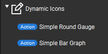
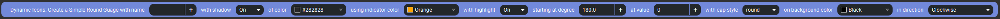
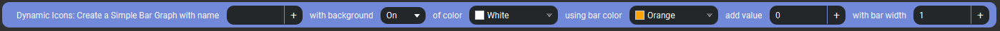
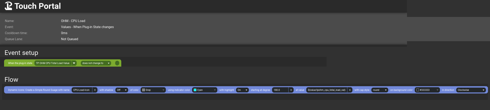
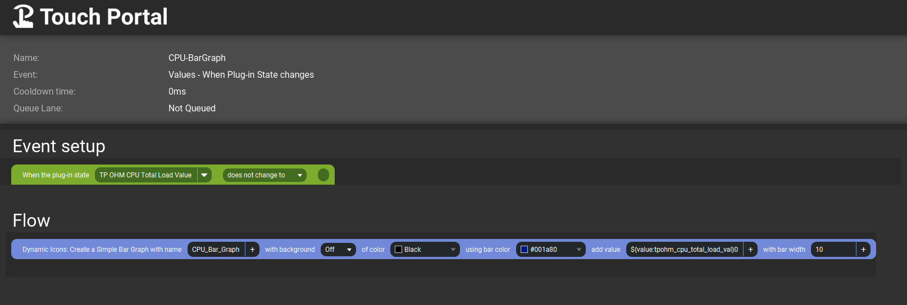
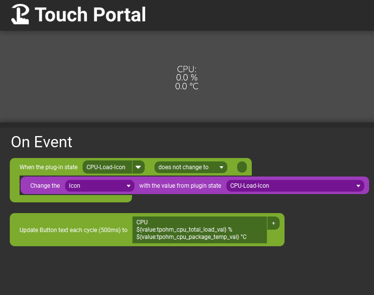
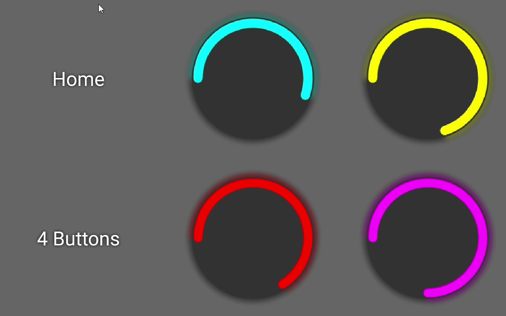
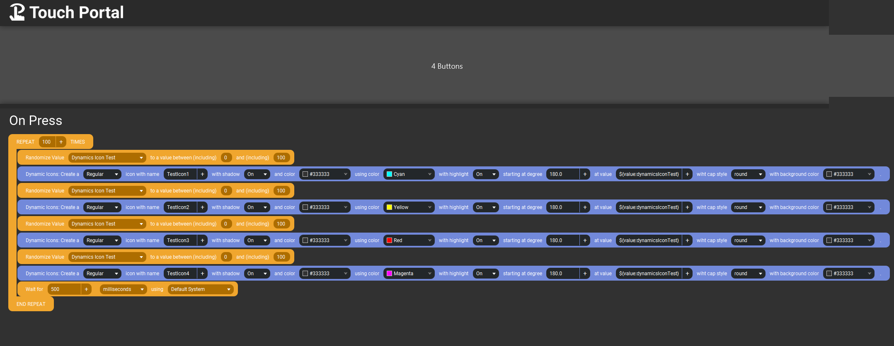

# TouchPortal-Dynamic-Icons
Generate Dynamic Icons for Touch Portal based on Actions and 0-100% values.

- [TouchPortal-Dynamic-Icons](#touchportal-dynamic-icons)
- [Change Log](#change-log)
- [What Is This?](#what-is-this)
- [Actions](#actions)
  - [Simple Round Gauge](#simple-round-gauge)
    - [Properties](#properties)
  - [Simple Bar Graph](#simple-bar-graph)
    - [Properties](#properties-1)
- [Sample Generator Uses](#sample-generator-uses)
  - [Simple Round Gauge - Usage from Events tab](#simple-round-gauge---usage-from-events-tab)
  - [Simple Bar Graph - Usage from Events tab](#simple-bar-graph---usage-from-events-tab)
- [Sample Icon Uses](#sample-icon-uses)
- [Dependencies](#dependencies)
- [Versioning](#versioning)
- [Authors](#authors)
- [License](#license)
- [Bugs/Enhancements](#bugsenhancements)
- [Acknowledgements](#acknowledgements)

# Change Log
```
v1.0.0 - Initial Release
  Features:
    - Actions for Simple Round Gauge and Simple Bar Graph
```

# What Is This?

Do you find the need to render out a bar graph, or round gauge in Touch Portal, but it it needs to be dynamic. Look no further, this plugin can do that for you.
This will draw bar graphs, or round gauges (simple styles only at first) based on your configured actions, colors, etc. (see Actions section for info), see Sample section for what you can do with it.

# Actions

Available Actions are



## Simple Round Gauge



### Properties
* Name: Can be any unique name for this image, it will become the State created by the plugin
* Shadow: On or Off - do you want a light shadow behind your round gauge
* Shadow Color: pick a color any color, only will display if Shadow is On
* Indicator Color: Color of the main round gauge indicator
* Highlight: On or Off - do you want a slight glow/highlight around the round guage (same color as indicator)
* Starting At Degree: 180 (default) - can be any number 0 - 360, 0 is right middle of circle
* Value: the value you want to represent - precentage 0 - 100
* Cap Style: butt|round|square - What do you want the end of the indicator to look like (round looks best)
* Background Color:  pick a color any color, if you want no background, set Opacity to 0 in the color selector
* Direction: clockwise|counter clockwise - which way do you want the gauge to go around the circle.

## Simple Bar Graph



### Properties
* Name: Can be any unique name for this image, it will become the State created by the plugin
* Background: On or Off - do you want the graph on a background color
* Background Color: pick a color any color, only will display if Background is On
* Bar Color: pick a color any color, this is the color of the bars being drawn
* Value: the value you want to represent - percentage 0 - 100
* Bar Width: 10px (default) - any number of pixels you want the bar graph to look like, 1-256 px


# Sample Generator Uses

## Simple Round Gauge - Usage from Events tab

Using the Touch Portal Open Hardware Monitor Plugin state, this will generate a Cyan colored radial gauge with no background and no shadow.



## Simple Bar Graph - Usage from Events tab

Using the Touch Portal Open Hardware Monitor Plugin state, this will generate a Blue colored bar graph with no background and each bar with have a width of 10px



# Sample Icon Uses

In order to use the icons, they first have to have been started to be generated. So at least one action needs to fire that will tell the plugin to generate a new state with the name you have provided. Once that is done here is an example of how to use that icon to change the icon on the button you have.



Here is an example of using 4 Simple Round guages on the same page, with 4 random values



Here is how the actions were setup for the above 4 Simple Round gauges



# Dependencies

1. [skia-canvas](https://www.npmjs.com/package/skia-canvas)
2. [touchportal-api](https://www.npmjs.com/package/touchportal-api)

# Versioning

We use [SemVer](http://semver.org/) for versioning. For the versions available, see the Releases section

# Authors

- **Jameson Allen** - _Initial work_ - [Spdermn02](https://github.com/spdermn02)

# License

This project is licensed under the MIT License - see the [LICENSE](LICENSE) file for details

# Bugs/Enhancements
Use the Github Issues tab to report any bugs/enhancements for this plug-in. Or mention them in the Official Touch Portal discord channel #dynamic-icons

# Acknowledgements
1. Thank you to Reinier and Ty, the Touch Portal Creators